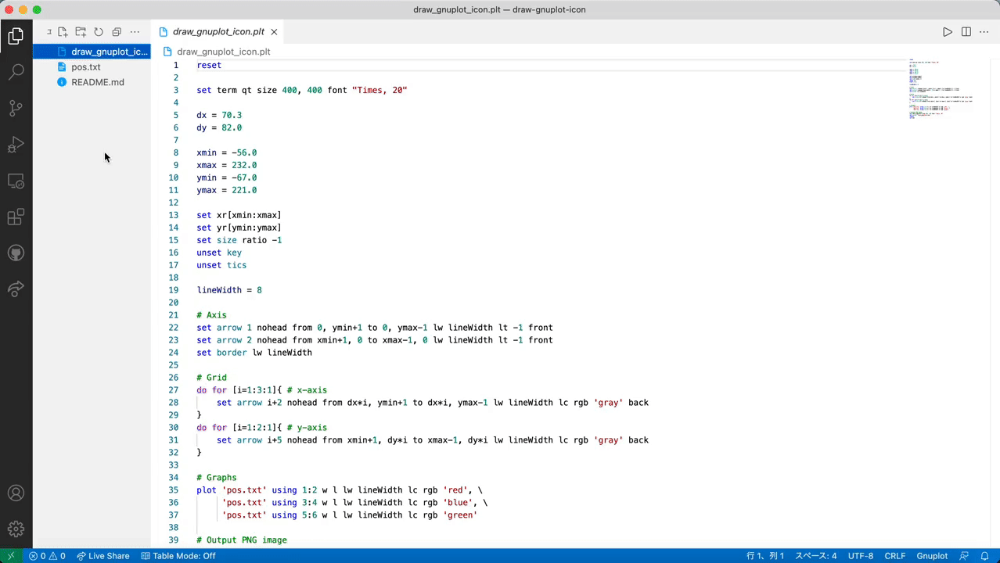

# draw-gnuplot-icon
"draw-gnuplot-icon" generates gnuplot icon by using `plot` command.

# DEMO
## VScode


## Get gnuplot icon image from qt window


# Features
- You can get gnuplot icon by running this code.
This code execute plot command in two type of terminals: `qt` / `pngcairo`.
- To plot graphs (<span style="color: red; ">red</span> / <span style="color: blue; ">blue</span> / <span style="color: green; ">green</span>), this program requires `pos.txt`.

# Operating environment
<!-- # Requirement -->
- macOS Big Sur 11.3.1 / Macbook Air (M1, 2020) 16GB
- gnuplot version 5.4 patchlevel 1
- VScode 1.56.2

<!-- # Installation -->

# Usage
```
git clone https://github.com/hiroloquy/draw-gnuplot-icon.git
cd draw-gnuplot-icon
gnuplot
load 'draw_gnuplot_icon.plt'
```

# Note
There are two ways to get a PNG image, using `qt` terminal and `pngcairo` terminal.
**If you follow the method using the `pngcairo` terminal, you will get a PNG image with a part of the upper left corner missing.** The cause of this problem is not yet known.


 
# Author
* Hiro Shigeyoshi
* Twitter: https://twitter.com/hiroloquy
 
# License
"draw_gnuplot_icon" is under [Hiroloquy](https://hiroloquy.com/).
 
